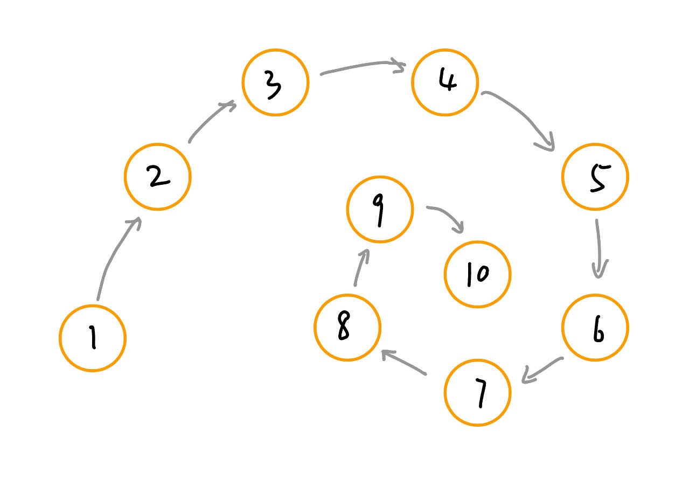
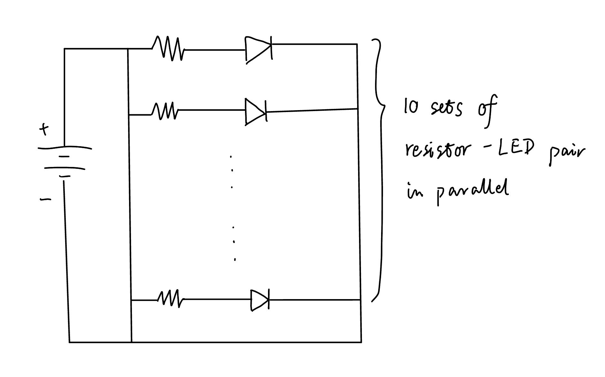

# HW10
 
This week's assignment is to create a clock using Arduino. I created a clock that contains 10 LED lights, each light up for 6 seconds within 1 minute. 

## Ideation & Circuit Design

I started by sketching the clock shape and its circuit diagram. I laid out the 10 LEDs to form a spiral shape, and the light goes toward the spiral's center in one minute. 

The circuit diagram is simply 10 resistor-LED pairs connected in parallel. 

## Implementation
The logic of this clock is simple. Since I separate 1 minute into 10 time intervals, I need 10 output ports to control the 10 LEDs. Therefore, in `void setup()`, I initialized the number 2 to 11 pins. Then, in `void loop()`, I wrote `second = int((floor(millis()/1000))) % 60` to convert the number of milliseconds into the number of seconds within the range of [0,59]. Initially, I wrote `second = (floor(millis()/1000)) % 60` but received an error. Upon searching online, I learned that this is because `floor(millis()/1000)` gives a double type number, while `%` (modulo) only works for integer type. Therefore, I use the `int()` function to convert the current number of seconds into an integer. 

Configuring the breadboard was harder than expected. While the circuit diagram seems straightforward, I had to consider where to put each component and wire so that the circuit works as expected and the LEDs form a spiral. Below are the steps I took to configure the breadboard: 
* I first adjusted the positions of the Arduino board and the LED lights. Initially, I wanted to move the LED spiral away from the board. However, that required more wires and longer wires, which can make my breadboard very messy. Therefore, I put the LEDs as close to the Arduino board as possible.
* Then, I put the resistors on the breadboard. Since each LED and its resistor are connected in series, resistors can be directly connected to the ground so I can use fewer wires.
* I connected the Arduino ground pin with a long column labeled "-" on one side of the breadboard using a short black wire. Then, I used a long black wire to connect the two "-" columns on both sides of the breadboard so that the two columns are both connected to the ground. This enables LEDs and resistors to connect neatly on the breadboard.

## Video

      

## Images

  
&nbsp; &nbsp; &nbsp; &nbsp;
  

  
&nbsp; &nbsp; &nbsp; &nbsp;
  

  

